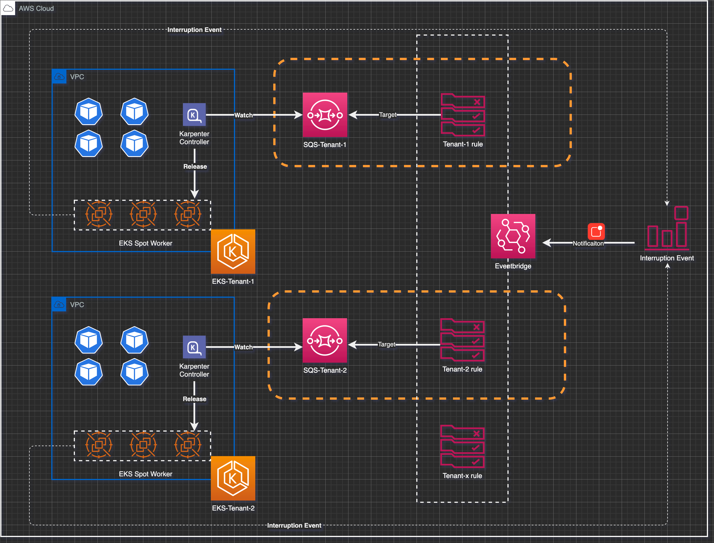
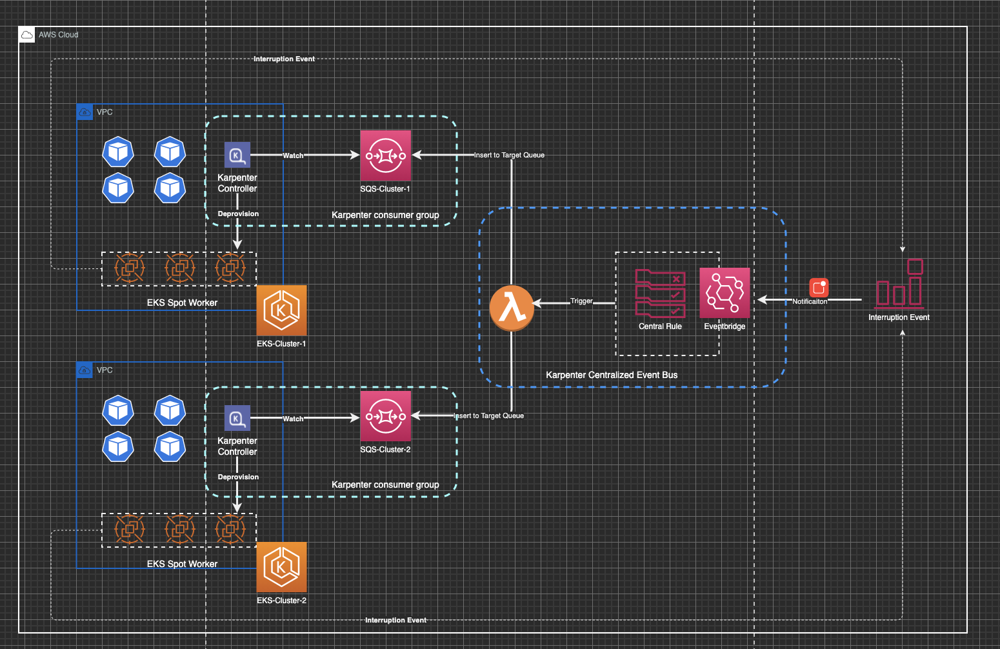
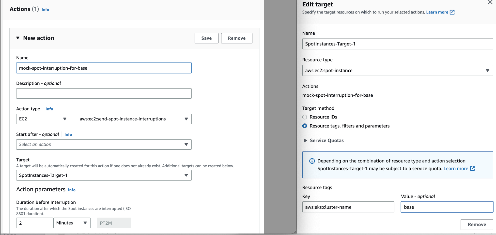
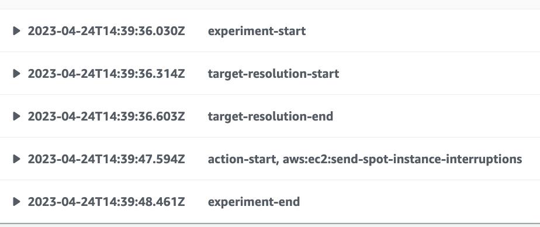
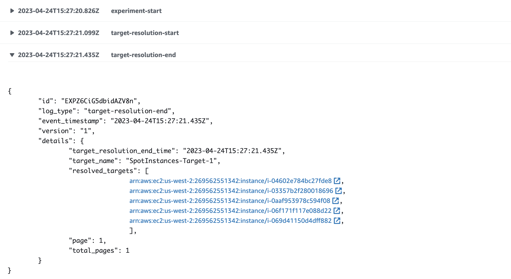

# Karpenter实践：多集群Spot Interruption事件处理总线设计
## 项目背景
Karpenter是AWS提出的kubernetes工作节点动态伸缩工具，其区别于CA（Cluster AutoScaler），具有Groupless，效率高，跟AWS集成更为紧密等众多优势。目前，越来越多的客户开始使用Karpenter来简化和优化他们的EKS集群自动扩展流程。特别是对于那些需要快速增加或减少节点数量以适应流量波动的企业来说，Karpenter可以帮助他们更好地管理他们的资源。另外采用Spot作为EKS的工作节点也成为了很多客户节约成本的一大重要手段。在Karpenter中，对于如何处理Spot实例回收带来的不稳定性影响，提供了两种方案：
* 方案1: 基于NTH（node termination handler）
* 方案2: 基于Evenbridge的事件触发机制（社区当前默认方案）

对于方案1，之前已经有很多文章进行了相关阐述，如[Kubernetes 节点弹性伸缩开源组件 Karpenter 实践：使用 Spot 实例进行成本优化](https://aws.amazon.com/cn/blogs/china/kubernetes-node-elastic-scaling-open-source-component-karpenter-practice-cost-optimization-using-spot-instance/). 本文主要的目的是对于方案2进行阐述，并提供了在客户实际应用场景中，如何基于事件总线的理念使其更优雅的对多集群Spot Interruption事件进行处理。

## 方案介绍

首先，回顾一下目前官方的Spot Interruption的处理流程图



其基本的逻辑为：
* 当对应EKS集群底层的Spot节点面临回收等事件时，触发EvenBridge Rule, 其详细的匹配如下
    * Spot Interruption Warnings
    * Scheduled Change Health Events 
    * Instance Terminating Events
    * Instance Stopping Events
* 每创建一个EKS集群，都对应的创建一组EvenBridge Rule和SQS对，用以接受和传递Interruption事件
* 通过配置Karpenter Controller的configmap指向对应集群的SQS，来消费/处理上述事件

可以看到，如果在单账户单region集群少的情况下，上述的设计并无不妥。但是在客户的实际使用中，当集群数量的多时候我们会发现几个明显的问题:

* 需要为每一个集群都创建一套规则，但是规则的内容却完全一样
  > 目前相关事件无法传递tag和基于tag过滤
* 因为规则完全相同，任一集群发生的相关事件会发送到其他队列的SQS队列中进行消费, 从而造成事件风暴
  > 查看源码可知，如果是非本集群消息，会直接进行删除

基于该设计带来的管理复杂性问题，笔者协同客户首先进行了解耦的设计. 在进行详细阐述前，首先回顾下在官方文档中如何进行Karpenter及相关Interruption处理组件的安装.

1. 安装Interruption处理组件和初始化集群,[参考](https://karpenter.sh/v0.27.3/getting-started/getting-started-with-karpenter/)
   
   在初始化配置中，提供了一个Cloudformation模版，其除了基本的Karpenter所需要的Role和权限等设置，还配置了对应的SQS队列和4个以其为目标的Evenbridge rule，如下所示:
   ```
   KarpenterInterruptionQueue:
    Type: AWS::SQS::Queue
    Properties:
      QueueName: !Sub "${ClusterName}"
      MessageRetentionPeriod: 300
   ScheduledChangeRule:
    Type: 'AWS::Events::Rule'
    Properties:
      EventPattern:
        source:
          - aws.health
        detail-type:
          - AWS Health Event
      Targets:
        - Id: KarpenterInterruptionQueueTarget
          Arn: !GetAtt KarpenterInterruptionQueue.Arn
    SpotInterruptionRule:
        Type: 'AWS::Events::Rule'
        Properties:
        EventPattern:
            source:
            - aws.ec2
            detail-type:
            - EC2 Spot Instance Interruption Warning
        Targets:
            - Id: KarpenterInterruptionQueueTarget
            Arn: !GetAtt KarpenterInterruptionQueue.Arn
    RebalanceRule:
        Type: 'AWS::Events::Rule'
        Properties:
        EventPattern:
            source:
            - aws.ec2
            detail-type:
            - EC2 Instance Rebalance Recommendation
        Targets:
            - Id: KarpenterInterruptionQueueTarget
            Arn: !GetAtt KarpenterInterruptionQueue.Arn
    InstanceStateChangeRule:
        Type: 'AWS::Events::Rule'
        Properties:
        EventPattern:
            source:
            - aws.ec2
            detail-type:
            - EC2 Instance State-change Notification
        Targets:
            - Id: KarpenterInterruptionQueueTarget
            Arn: !GetAtt KarpenterInterruptionQueue.Arn
    ```
    初始化完毕后会再进行相关集群的安装(已有集群也可，本文不详细赘述)
2. 进行Karpenter的安装
   ```
   helm upgrade --install karpenter oci://public.ecr.aws/karpenter/karpenter --version ${KARPENTER_VERSION} --namespace karpenter --create-namespace \
    --set serviceAccount.annotations."eks\.amazonaws\.com/role-arn"=${KARPENTER_IAM_ROLE_ARN} \
    --set settings.aws.clusterName=${CLUSTER_NAME} \
    --set settings.aws.defaultInstanceProfile=KarpenterNodeInstanceProfile-${CLUSTER_NAME} \
    --set settings.aws.interruptionQueueName=${CLUSTER_NAME} \
    --wait
    ```
    其中 
    ```
    --set settings.aws.interruptionQueueName=${CLUSTER_NAME}
    ```
    即为启动karpenter controller对于步骤1中配置的事件和SQS队列消息的监听和处理。**此处需要注意**，如果刚开始创建Karpenter的时候没有进行配置，那么后续处理启用的时候，需要参考如下进行enable: 
    ```
    apiVersion: v1
    kind: ConfigMap
    metadata:
      name: karpenter-global-settings
      namespace: karpenter
    data:
      ...
      aws.interruptionQueueName: karpenter-cluster
    ```
    配置完成后需要执行对应Karpenter deployment 重启的操作使其生效
    ```
    $ kubectl rollout restart deployment karpenter

    ```
回顾完原始的步骤后，笔者最初和客户的设计为只在第一个集群的配置中配置Eventbridge Rule，后续集群只创建对应的SQS队列并动态在上述Rule中的添加新的SQS队列为Target。然而参照官方文档可知，同一条Eventbridge Rule最大的触发Target为5，并且为硬限制不可修改。考虑到该方案的局限性，故并不对此方案进行进一步探讨，但是我们应用同样的解耦思路进行下一方案的探索。

## 利用lambda实现事件分发总线的改进方案介绍及测试
### 方案介绍

借鉴事件总线的处理逻辑，新方案采用基于Lambda作为事件总线中心，基于不同EKS集群的特定标签，进行事件的精准分发，项目的架构如下所示：

其整体的流程为：
* 在第一个集群中生成中，配置全套的lambda和监听事件，在后续的集群/karpenter的安装中只生成对应集群的SQS和配置监听
  > 此处也可以完全单独进行配置，与集群创建进行解偶。
* 当对应集群有Interruption事件产生时，lambda函数通过instance-id得到对应的Tag从而判断发生事件的集群，进而把对应的事件指向性投递到队列中
* 每个集群的Karpenter通过监听对应SQS队列，进行对应Interruption事件的处理

### 具体部署
在具体部署中，在第一次集群中会生成对应的SQS以及基于Lambda的事件分发总线，在之后的部署中只会进行相应SQS的配套部署. 我们实验中会参照Karpenter官方的[部署](https://karpenter.sh/v0.27.3/getting-started/getting-started-with-karpenter/)流程，进行整体的部署，其中相关的前提条件也请参考部署链接。

#### 首个/基础集群部署
下载项目
```
$ git clone https://github.com/jansony1/multi-cluster-mangement-karpenter.git
$ cd multi-cluster-mangement-karpenter
```
配置环境变量
```
$ export KARPENTER_VERSION=v0.27.3
$ export CLUSTER_NAME="base"
$ export AWS_DEFAULT_REGION="us-west-2"
$ export AWS_ACCOUNT_ID="$(aws sts get-caller-identity --query Account --output text)"
$ export TEMPOUT=$(mktemp)
```
安装事件总线和karpenter相关的权限
```
$ aws cloudformation deploy \
  --stack-name "Karpenter-${CLUSTER_NAME}" \
  --template-file ./cloudformations/multi_cluster_infra_stack.yaml \
  --capabilities CAPABILITY_NAMED_IAM \
  --parameter-overrides "ClusterName=${CLUSTER_NAME}"
```
创建集群
```
$ eksctl create cluster -f - <<EOF
---
apiVersion: eksctl.io/v1alpha5
kind: ClusterConfig
metadata:
  name: ${CLUSTER_NAME}
  region: ${AWS_DEFAULT_REGION}
  version: "1.24"
  tags:
    karpenter.sh/discovery: ${CLUSTER_NAME}

iam:
  withOIDC: true
  serviceAccounts:
  - metadata:
      name: karpenter
      namespace: karpenter
    roleName: ${CLUSTER_NAME}-karpenter
    attachPolicyARNs:
    - arn:aws:iam::${AWS_ACCOUNT_ID}:policy/KarpenterControllerPolicy-${CLUSTER_NAME}
    roleOnly: true

iamIdentityMappings:
  - arn: "arn:aws:iam::${AWS_ACCOUNT_ID}:role/KarpenterNodeRole-${CLUSTER_NAME}"
    username: system:node:{{EC2PrivateDNSName}}
    groups:
    - system:bootstrappers
    - system:nodes

  managedNodeGroups:
  - instanceType: m5.large
    amiFamily: AmazonLinux2
    name: ${CLUSTER_NAME}-ng
    desiredCapacity: 2
EOF
```
配置相关权限的环境变量
```
$ export CLUSTER_ENDPOINT="$(aws eks describe-cluster --name ${CLUSTER_NAME} --query "cluster.endpoint" --output text)"
$ export KARPENTER_IAM_ROLE_ARN="arn:aws:iam::${AWS_ACCOUNT_ID}:role/${CLUSTER_NAME}-karpenter"

$ echo $CLUSTER_ENDPOINT $KARPENTER_IAM_ROLE_ARN
```
安装Karpenter

```
$ docker logout public.ecr.aws

$ helm upgrade --install karpenter oci://public.ecr.aws/karpenter/karpenter --version ${KARPENTER_VERSION} --namespace karpenter --create-namespace \
  --set serviceAccount.annotations."eks\.amazonaws\.com/role-arn"=${KARPENTER_IAM_ROLE_ARN} \
  --set settings.aws.clusterName=${CLUSTER_NAME} \
  --set settings.aws.defaultInstanceProfile=KarpenterNodeInstanceProfile-${CLUSTER_NAME} \
  --set settings.aws.interruptionQueueName=${CLUSTER_NAME} \
  --set controller.resources.requests.cpu=1 \
  --set controller.resources.requests.memory=1Gi \
  --set controller.resources.limits.cpu=1 \
  --set controller.resources.limits.memory=1Gi \
  --wait
```
配置对应的Provisioner
```
$ cat <<EOF | kubectl apply -f -
apiVersion: karpenter.sh/v1alpha5
kind: Provisioner
metadata:
  name: default
spec:
  annotations:
    example.com/owner: aws
  requirements:
    - key: karpenter.sh/capacity-type
      operator: In
      values: ["spot"]
    - key: node.kubernetes.io/instance-type
      operator: In
      values: ["m5.xlarge", "m5.2xlarge"]
  ttlSecondsAfterEmpty: 30
  ttlSecondsUntilExpired: 2592000
  providerRef:
    name: default

---
apiVersion: karpenter.k8s.aws/v1alpha1
kind: AWSNodeTemplate
metadata:
  name: default
spec:
  tags:
    nodeBelongTo: aws
  subnetSelector:
    karpenter.sh/discovery: ${CLUSTER_NAME}
  securityGroupSelector:
    karpenter.sh/discovery: ${CLUSTER_NAME}

EOF
```
此时整个Karpenter和其相关的Interruption事件处理总线的Infra已经构建完毕，有兴趣的读者可以通过以下方式查看相关配置和Lambda函数的逻辑
```
$ cat ./cloudformations/multi_cluster_infra_stack.yaml
```
相较于社区原始的设计，此处把4类相关事件的触发目标都改为了基于Lambda的事件总线，并且基于源码的设计进一步过滤了监听的事件。具体实现逻辑中通过在Lambda中基于对EC2的Tag的识别，来将事件发送到指定集群的SQS队列中进行后续Karpenter Controller的处理。


#### 其他业务集群部署
对于除了需要配置事件总线的初始化集群以外的其他集群来说，其主要的差别为
* Cluster的名字需要在配置环境变量步骤进行替换
* 对应的Cloudformation需要替换成非Infra版本的
  * 该集群只会设置相关Karpneter权限和SQS队列
  
因此，我们后续只摘取差异化的两步进行阐述，其他流程请参照基础版的集群部署

配置环境变量
```
$ export KARPENTER_VERSION=v0.27.3
$ export CLUSTER_NAME="tenant-1"
$ export AWS_DEFAULT_REGION="us-west-2"
$ export AWS_ACCOUNT_ID="$(aws sts get-caller-identity --query Account --output text)"
$ export TEMPOUT=$(mktemp)
```
安装事件总线和karpenter相关的权限
```
$ aws cloudformation deploy \
  --stack-name "Karpenter-${CLUSTER_NAME}" \
  --template-file ./cloudformations/multi_cluster_other_stack.yaml \
  --capabilities CAPABILITY_NAMED_IAM \
  --parameter-overrides "ClusterName=${CLUSTER_NAME}"
```

部署完毕后，可以在EKS控制台同时看到基础集群以及业务集群tenant-1-cluster

### 使用FIS（Fault Ingestion simulator）来进行模拟测试

下面我们用AWS的[FIS](https://aws.amazon.com/cn/fis/)服务来模拟
* 基础cluster和业务集群单个节点发生Spot中断事件的处理情况，以及是否会产生集群间干扰
* Tenant-1-cluster中多个节点分别发生Spot中断事件后的处理情况，以及是否会产生集群间干扰

#### 部署示例应用触发Karpenter生成Spot节点
在本文中，两个cluster的托管工作节点均为2核，那么我们分别在两个Cluster中部署一个3核需求的应用，从而触发对应Spot节点的生成。

查看当前集群
```
$ eksctl get cluster
NAME			REGION		EKSCTL CREATED
infra	us-west-2	True
tenant-1-cluster		us-west-2	True
```

部署示例应用
```
$ cat <<EOF | kubectl apply -f -
apiVersion: apps/v1
kind: Deployment
metadata:
  name: inflate
spec:
  replicas: 1
  selector:
    matchLabels:
      app: inflate
  template:
    metadata:
      labels:
        app: inflate
    spec:
      terminationGracePeriodSeconds: 0
      containers:
        - name: inflate
          image: public.ecr.aws/eks-distro/kubernetes/pause:3.7
          resources:
            requests:
              cpu: 3
EOF
```
查看状态
```
$ kubectl get pods -owide
$ kubectl get pods -owide
NAME                      READY   STATUS    RESTARTS   AGE   IP                NODE                                          NOMINATED NODE   READINESS GATES
inflate-d4d675747-sqdqw   1/1     Running   0          38m   192.168.160.221   ip-192-168-170-8.us-west-2.compute.internal   <none>           <none>
$ kubectl get nodes
NAME                                          STATUS   ROLES    AGE   VERSION
ip-192-168-1-230.us-west-2.compute.internal   Ready    <none>   81m   v1.24.11-eks-a59e1f0
ip-192-168-170-8.us-west-2.compute.internal   Ready    <none>   39m   v1.24.11-eks-a59e1f0
ip-192-168-87-89.us-west-2.compute.internal   Ready    <none>   81m   v1.24.11-eks-a59e1f0
```
观察发现基于Karpenter动态生成的节点已经运行. 然后切换到tenant-1-cluster，重复上述动作，但是Deployment的replica数量调整为8，从而来模拟大规模interruption情况下该方案的处理能力,以及测试两个集群事件是否会产生互相干扰。
```
$ cat <<EOF | kubectl apply -f -
apiVersion: apps/v1
kind: Deployment
metadata:
  name: inflate
spec:
  replicas: 10
  selector:
    matchLabels:
      app: inflate
  template:
    metadata:
      labels:
        app: inflate
    spec:
      terminationGracePeriodSeconds: 0
      containers:
        - name: inflate
          image: public.ecr.aws/eks-distro/kubernetes/pause:3.7
          resources:
            requests:
              cpu: 3
EOF
```

#### 配置测试事件
在FIS中，我们分别基于tag选定对应的EKS集群，配置对应的测试实验. 配置针对于基础cluster的模版。分别入下图所示



#### 执行测试和观察结果
**实验1:** 基础cluster和业务集群单个节点发生Spot中断事件的处理情况

点击上一步骤中生成的针对于基础cluster的模版，执行Start。点击Experiment Log Event观察到如下，说明事件触发完毕.

然后查看Karpenter Controller日志
```
### Interruption detection
2023-04-24T14:39:51.074Z	DEBUG	controller.interruption	removing offering from offerings	{"commit": "beb0a64-dirty", "queue": "karpenter-base", "messageKind": "SpotInterruptionKind", "node": "ip-192-168-124-105.us-west-2.compute.internal", "action": "CordonAndDrain", "reason": "SpotInterruptionKind", "instance-type": "m5.xlarge", "zone": "us-west-2c", "capacity-type": "spot", "ttl": "3m0s"}

## Graceful deletion
2023-04-24T14:39:51.090Z	INFO	controller.interruption	deleted node from interruption message	{"commit": "beb0a64-dirty", "queue": "karpenter-base", "messageKind": "SpotInterruptionKind", "node": "ip-192-168-124-105.us-west-2.compute.internal", "action": "CordonAndDrain"}
2023-04-24T14:39:51.091Z	INFO	controller.termination	cordoned node	{"commit": "beb0a64-dirty", "node": "ip-192-168-124-105.us-west-2.compute.internal"}
2023-04-24T14:39:51.458Z	INFO	controller.termination	deleted node	{"commit": "beb0a64-dirty", "node": "ip-192-168-124-105.us-west-2.compute.internal"}
2023-04-24T14:39:51.703Z	INFO	controller.termination	deleted node	{"commit": "beb0a64-dirty", "node": "ip-192-168-124-105.us-west-2.compute.internal"}
2023-04-24T14:39:52.252Z	INFO	controller.provisioner	found provisionable pod(s)	{"commit": "beb0a64-dirty", "pods": 1}
2023-04-24T14:39:52.252Z	INFO	controller.provisioner	computed new node(s) to fit pod(s)	{"commit": "beb0a64-dirty", "nodes": 1, "pods": 1}
2023-04-24T14:39:52.252Z	INFO	controller.provisioner	launching machine with 1 pods requesting {"cpu":"3125m","pods":"4"} from types m5.xlarge, m5.2xlarge	{"commit": "beb0a64-dirty", "provisioner": "default"}
2023-04-24T14:39:52.434Z	DEBUG	controller.provisioner.cloudprovider	created launch template	{"commit": "beb0a64-dirty", "provisioner": "default", "launch-template-name": 
"karpenter-base-12738716852343601265", "launch-template-id": "lt-04a670291a536d43e"}

## Launch new Spot instance
2023-04-24T14:39:54.554Z	INFO	controller.provisioner.cloudprovider	launched new instance	{"commit": "beb0a64-dirty", "provisioner": "default", "id": "i-0e2deaedad42065ac", "hostname": "ip-192-168-188-93.us-west-2.compute.internal", "instance-type": "m5.xlarge", "zone": "us-west-2a", "capacity-type": 
```
上述controller日志经过拆解，主要分为三部分
* Detect interruption
* Graceful deletion
* Launch new Spot instance 

结合FIS日志可以看出从事件发生(14:39:48)到事件处理完毕（14:39:54)，总计6秒的事件即可完成整个interruption事件的处理。最后查看对应的karpenter-base SQS队列，发现所有事件均被处理完成. 另外查看karpenter-tenant-1队列，并无新消息传递。

**实验2** :Tenant-1-cluster中多个节点分别发生Spot中断事件后的处理情况

查看当前集群节点情况
```
$ kubectl get nodes
NAME                                            STATUS   ROLES    AGE    VERSION
ip-192-168-1-230.us-west-2.compute.internal     Ready    <none>   160m   v1.24.11-eks-a59e1f0
ip-192-168-141-174.us-west-2.compute.internal   Ready    <none>   20m    v1.24.11-eks-a59e1f0
ip-192-168-189-225.us-west-2.compute.internal   Ready    <none>   102s   v1.24.11-eks-a59e1f0
ip-192-168-33-98.us-west-2.compute.internal     Ready    <none>   20m    v1.24.11-eks-a59e1f0
ip-192-168-57-234.us-west-2.compute.internal    Ready    <none>   20m    v1.24.11-eks-a59e1f0
ip-192-168-67-99.us-west-2.compute.internal     Ready    <none>   20m    v1.24.11-eks-a59e1f0
ip-192-168-87-89.us-west-2.compute.internal     Ready    <none>   160m   v1.24.11-eks-a59e1f0
```
可以发现，除了managed节点，karpenter基于动态合并选择的特性，生成了3个m5.2xlarge节点和两个m5.xlarge。
> FIS同时触发的instance限制也是5

点击上一步骤中生成的tenant-1-cluster的模版，执行Start。查看Event log如下图所示

进一步查看Karpenter controller的日志
```
2023-04-24T15:27:34.344Z	DEBUG	controller.interruption	removing offering from offerings	{"commit": "d7e22b1-dirty", "queue": "other-cluster", "messageKind": "SpotInterruptionKind", "node": "ip-192-168-141-174.us-west-2.compute.internal", "action": "CordonAndDrain", "reason": "SpotInterruptionKind", "instance-type": "m5.2xlarge", "zone": "us-west-2c", "capacity-type": "spot", "ttl": "3m0s"}
2023-04-24T15:27:34.359Z	INFO	controller.interruption	deleted node from interruption message	{"commit": "d7e22b1-dirty", "queue": "other-cluster", "messageKind": "SpotInterruptionKind", "node": "ip-192-168-141-174.us-west-2.compute.internal", "action": "CordonAndDrain"}
2023-04-24T15:27:34.417Z	INFO	controller.termination	cordoned node	{"commit": "d7e22b1-dirty", "node": "ip-192-168-141-174.us-west-2.compute.internal"}
2023-04-24T15:27:34.567Z	DEBUG	controller.interruption	removing offering from offerings	{"commit": "d7e22b1-dirty", "queue": "other-cluster", "messageKind": "SpotInterruptionKind", "node": "ip-192-168-189-225.us-west-2.compute.internal", "action": "CordonAndDrain", "reason": "SpotInterruptionKind", "instance-type": "m5.xlarge", "zone": "us-west-2a", "capacity-type": "spot", "ttl": "3m0s"}
2023-04-24T15:27:34.586Z	INFO	controller.interruption	deleted node from interruption message	{"commit": "d7e22b1-dirty", "queue": "other-cluster", "messageKind": "SpotInterruptionKind", "node": "ip-192-168-189-225.us-west-2.compute.internal", "action": "CordonAndDrain"}
2023-04-24T15:27:34.660Z	INFO	controller.termination	cordoned node	{"commit": "d7e22b1-dirty", "node": "ip-192-168-189-225.us-west-2.compute.internal"}
2023-04-24T15:27:34.684Z	DEBUG	controller.interruption	removing offering from offerings	{"commit": "d7e22b1-dirty", "queue": "other-cluster", "messageKind": "SpotInterruptionKind", "node": "ip-192-168-67-99.us-west-2.compute.internal", "action": "CordonAndDrain", "reason": "SpotInterruptionKind", "instance-type": "m5.xlarge", "zone": "us-west-2a", "capacity-type": "spot", "ttl": "3m0s"}
2023-04-24T15:27:34.735Z	INFO	controller.interruption	deleted node from interruption message	{"commit": "d7e22b1-dirty", "queue": "other-cluster", "messageKind": "SpotInterruptionKind", "node": "ip-192-168-67-99.us-west-2.compute.internal", "action": "CordonAndDrain"}
2023-04-24T15:27:34.762Z	INFO	controller.termination	cordoned node	{"commit": "d7e22b1-dirty", "node": "ip-192-168-67-99.us-west-2.compute.internal"}
2023-04-24T15:27:34.986Z	INFO	controller.termination	deleted node	{"commit": "d7e22b1-dirty", "node": "ip-192-168-141-174.us-west-2.compute.internal"}
2023-04-24T15:27:35.179Z	DEBUG	controller.interruption	removing offering from offerings	{"commit": "d7e22b1-dirty", "queue": "other-cluster", "messageKind": "SpotInterruptionKind", "node": "ip-192-168-57-234.us-west-2.compute.internal", "action": "CordonAndDrain", "reason": "SpotInterruptionKind", "instance-type": "m5.2xlarge", "zone": "us-west-2c", "capacity-type": "spot", "ttl": "3m0s"}
2023-04-24T15:27:35.194Z	INFO	controller.interruption	deleted node from interruption message	{"commit": "d7e22b1-dirty", "queue": "other-cluster", "messageKind": "SpotInterruptionKind", "node": "ip-192-168-57-234.us-west-2.compute.internal", "action": "CordonAndDrain"}
2023-04-24T15:27:35.236Z	INFO	controller.termination	cordoned node	{"commit": "d7e22b1-dirty", "node": "ip-192-168-57-234.us-west-2.compute.internal"}
2023-04-24T15:27:35.270Z	DEBUG	controller.interruption	removing offering from offerings	{"commit": "d7e22b1-dirty", "queue": "other-cluster", "messageKind": "SpotInterruptionKind", "node": "ip-192-168-33-98.us-west-2.compute.internal", "action": "CordonAndDrain", "reason": "SpotInterruptionKind", "instance-type": "m5.2xlarge", "zone": "us-west-2c", "capacity-type": "spot", "ttl": "3m0s"}
2023-04-24T15:27:35.308Z	INFO	controller.interruption	deleted node from interruption message	{"commit": "d7e22b1-dirty", "queue": "other-cluster", "messageKind": "SpotInterruptionKind", "node": "ip-192-168-33-98.us-west-2.compute.internal", "action": "CordonAndDrain"}
2023-04-24T15:27:35.333Z	INFO	controller.termination	cordoned node	{"commit": "d7e22b1-dirty", "node": "ip-192-168-33-98.us-west-2.compute.internal"}
2023-04-24T15:27:35.435Z	INFO	controller.termination	deleted node	{"commit": "d7e22b1-dirty", "node": "ip-192-168-67-99.us-west-2.compute.internal"}
2023-04-24T15:27:35.445Z	INFO	controller.termination	deleted node	{"commit": "d7e22b1-dirty", "node": "ip-192-168-189-225.us-west-2.compute.internal"}
2023-04-24T15:27:35.870Z	INFO	controller.termination	deleted node	{"commit": "d7e22b1-dirty", "node": "ip-192-168-57-234.us-west-2.compute.internal"}
2023-04-24T15:27:35.890Z	INFO	controller.termination	deleted node	{"commit": "d7e22b1-dirty", "node": "ip-192-168-33-98.us-west-2.compute.internal"}
2023-04-24T15:27:38.317Z	INFO	controller.provisioner	found provisionable pod(s)	{"commit": "d7e22b1-dirty", "pods": 8}
2023-04-24T15:27:38.317Z	INFO	controller.provisioner	computed new machine(s) to fit pod(s)	{"commit": "d7e22b1-dirty", "machines": 4, "pods": 8}
2023-04-24T15:27:38.317Z	INFO	controller.provisioner	launching machine with 2 pods requesting {"cpu":"6125m","pods":"4"} from types m5.2xlarge	{"commit": "d7e22b1-dirty", "provisioner": "default"}
2023-04-24T15:27:38.328Z	INFO	controller.provisioner	launching machine with 2 pods requesting {"cpu":"6125m","pods":"4"} from types m5.2xlarge	{"commit": "d7e22b1-dirty", "provisioner": "default"}
2023-04-24T15:27:38.338Z	INFO	controller.provisioner	launching machine with 2 pods requesting {"cpu":"6125m","pods":"4"} from types m5.2xlarge	{"commit": "d7e22b1-dirty", "provisioner": "default"}
2023-04-24T15:27:38.348Z	INFO	controller.provisioner	launching machine with 2 pods requesting {"cpu":"6125m","pods":"4"} from types m5.2xlarge	{"commit": "d7e22b1-dirty", "provisioner": "default"}
2023-04-24T15:27:38.605Z	DEBUG	controller.provisioner.cloudprovider	discovered launch template	{"commit": "d7e22b1-dirty", "provisioner": "default", "launch-template-name": "karpenter.k8s.aws/3843415971142493028"}

## Launch new spot instance 
2023-04-24T15:27:41.691Z	INFO	controller.provisioner.cloudprovider	launched instance	{"commit": "d7e22b1-dirty", "provisioner": "default", "id": "i-0a458f323d52c9380", "hostname": "ip-192-168-64-130.us-west-2.compute.internal", "instance-type": "m5.2xlarge", "zone": "us-west-2a", "capacity-type": "spot", "capacity": {"cpu":"8","ephemeral-storage":"20Gi","memory":"30310Mi","pods":"58"}}
2023-04-24T15:27:41.691Z	INFO	controller.provisioner.cloudprovider	launched instance	{"commit": "d7e22b1-dirty", "provisioner": "default", "id": "i-0c482c9d0e12560de", "hostname": "ip-192-168-171-10.us-west-2.compute.internal", "instance-type": "m5.2xlarge", "zone": "us-west-2a", "capacity-type": "spot", "capacity": {"cpu":"8","ephemeral-storage":"20Gi","memory":"30310Mi","pods":"58"}}
2023-04-24T15:27:41.691Z	INFO	controller.provisioner.cloudprovider	launched instance	{"commit": "d7e22b1-dirty", "provisioner": "default", "id": "i-049d6c4095bdde7a8", "hostname": "ip-192-168-175-127.us-west-2.compute.internal", "instance-type": "m5.2xlarge", "zone": "us-west-2a", "capacity-type": "spot", "capacity": {"cpu":"8","ephemeral-storage":"20Gi","memory":"30310Mi","pods":"58"}}
2023-04-24T15:27:41.691Z	INFO	controller.provisioner.cloudprovider	launched instance	{"commit": "d7e22b1-dirty", "provisioner": "default", "id": "i-01f006230f5e0c808", "hostname": "ip-192-168-85-3.us-west-2.compute.internal", "instance-type": "m5.2xlarge", "zone": "us-west-2a", "capacity-type": "spot", "capacity": {"cpu":"8","ephemeral-storage":"20Gi","memory":"30310Mi","pods":"58"}}
```
可以看到，相较于单一节点的interruption事件，Karpenter在并行交替处理多个节点的事件，最终成功新Launch了4台m5.2xlarge
> 在生产集群中，如果大规模使用Spot示例，建议适配Karpenter Controller的CPU和内存。

最后查看karpenter-tenant-1 SQS和karpenter-base SQS，发现消息被及时处理，也未出现干扰情况。

## 总结

本文阐述了一种客户在基于karpenter对多集群Spot Interruption事件管理的优化设计，其从易用性和可维护性等多个角度都进行了改善。另外从成本的角度来说，可以在本文的RouterLambda前再配一集中化的Amazon SQS，即所有事件统一发送到该Amazon SQS, 利用Amazon Lambda的Batch机制批量处理对应请求，然后再进行批量发送到指定的下游队列.


## 参考文档
Karpenter: https://karpenter.sh/v0.27.3/getting-started/getting-started-with-karpenter/

Karpenter处理Interruption：https://karpenter.sh/v0.27.3/concepts/deprovisioning/, https://github.com/aws/karpenter/blob/9d9fcb44b59f4f676e28351cd39790f8ef95d5a1/designs/deprovisioning.md

Karpenter源代码逻辑：https://github.com/aws/karpenter/blob/7afa5630980556742b2337574757dea9f9b99a29/pkg/controllers/interruption/controller.go

Karpenter event定义: https://github.com/aws/karpenter/blob/7afa5630980556742b2337574757dea9f9b99a29/pkg/controllers/interruption/events/events.go


